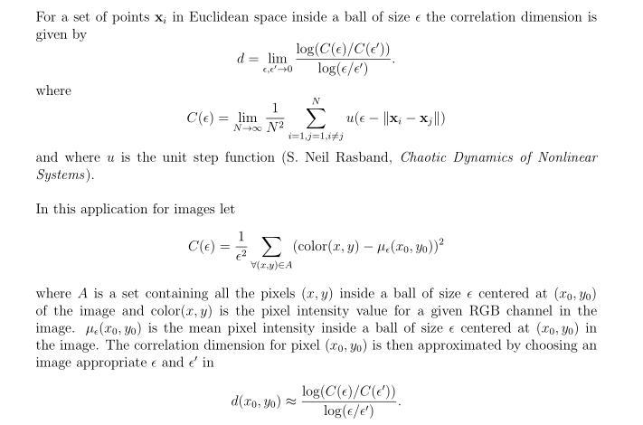

## Fractal image analyzer

Approximate instantaneous fractal dimension of each pixel in the image using colour variance inside boxes sized e1 and e2.

Usage: `./fimg e1 e2 amplitude image.jpg`

## Description

## Some interesting examples

`./fimg 5 20 150 test1.jpg`

`./fimg 10 15 80 test3.jpg`

`./fimg 5 20 80 test3.jpg`

