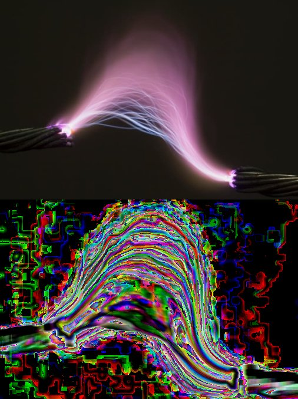
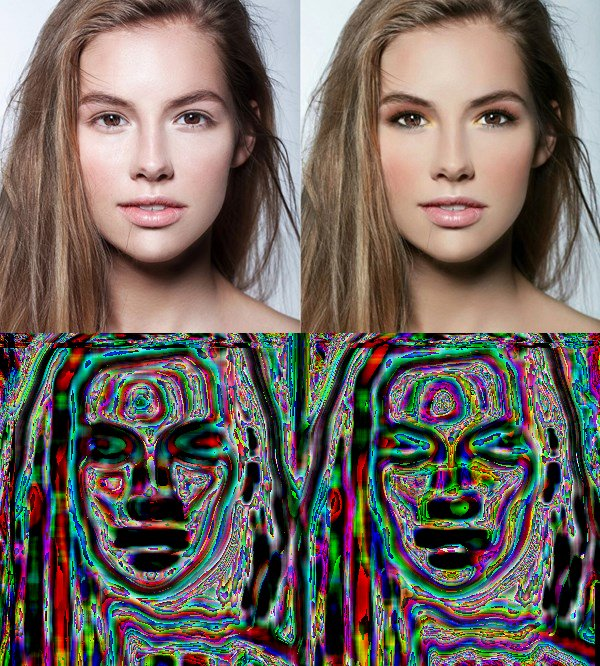
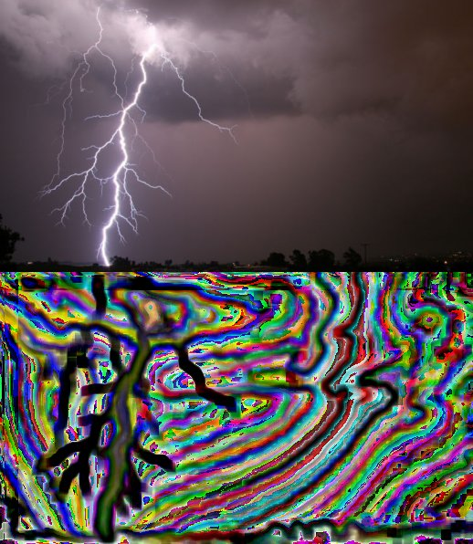

## Fractal image analyzer

Approximate instantaneous fractal dimension of each pixel in the image using colour variance inside boxes sized d1 and d2.

Usage: `./fimg d1 d2 amplitude image.jpg`

## Description

Starting with the correlation dimension definition of fractal dimension:

\[ C(\epsilon) = \lim_{N \to \infty} \frac{1}{N^2} \sum_{i=1,j=1,i\neq j}^N u(\epsilon - \|\mathbf{x}_i - \mathbf{x}_j\|) \]

\[ d = \lim_{\epsilon,\epsilon' \to 0} \frac{\log(C(\epsilon)/C(\epsilon'))}{\log(\epsilon/\epsilon')}\text{.} \]

## Some interesting examples

`./fimg 5 20 150 test1.jpg`

`./fimg 10 15 80 test3.jpg`

`./fimg 5 20 80 test3.jpg`

